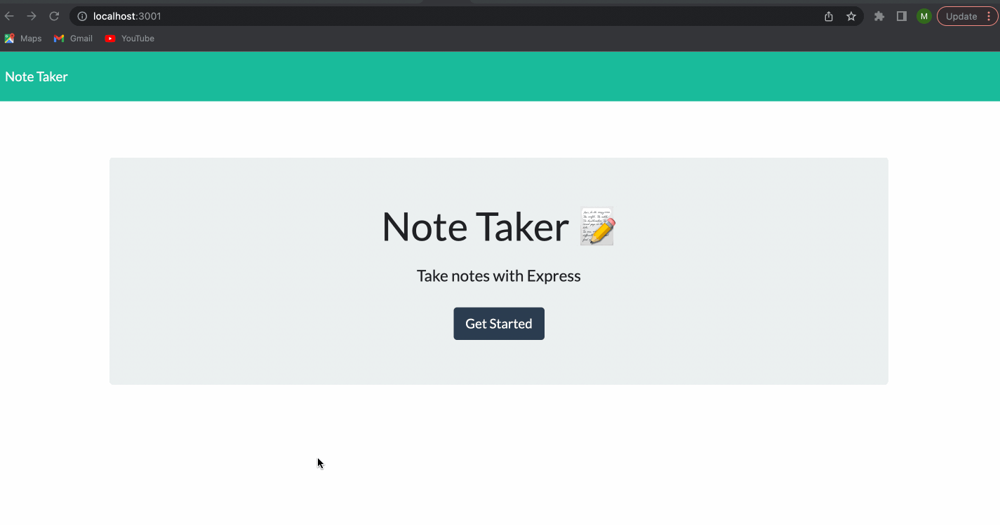

# Note Taking Webpage 

## Description
This application allows users to write notes and save them.

Deployed application: https://blooming-wave-42021.herokuapp.com/

## Table of Contents
- [Visual](#visual)
- [Technologies Used](#technologies-used)
- [Usage](#usage)
- [Code Snippet](#code-snippet)
- [Contributions](#contributing)
- [Test](#tests)
- [Questions](#questions)
- [License](#license)

## Visual 




## Technologies Used

1. HTML
2. CSS
3. Javascript
4. Express
5. Node.js
6. Heroku

## Usage

Start by clicking the "Getting Started" button on the landing screen. There you will taken to a notes page. Populate the note title and notes text body. Once ready, click the saved button icon in the top right corner or click the plus icon to start a new note. All saved notes will appear in a column on the left. To access saved notes, simply click on the note and it will reapper and you can edit once again. 

## Code Snippet

Following code shows a post request that allows user to save their code on the page so they access their saved nodes at a later time.

```ruby
app.post('/api/notes', (req, res) => {
    console.info(`${req.method} request received to add new note`)
    const { title, text } = req.body;
    if (title && text) {
      const newNote = {
        title,
        text,
        id: uuid(),
      };
      fs.readFile('./db/db.json', 'utf8', (err, data) => {
        if(err) {
            console.log(err);
        } else {
            const parsedNotes = JSON.parse(data);
            parsedNotes.push(newNote)
            fs.writeFile(
                './db/db.json', 
                JSON.stringify(parsedNotes, null, 4),
                (writeErr) =>
                    writeErr 
                        ? console.error(writeErr) 
                        : console.info('New note has been created')
                        );
                    }
                  });
                  const response = {
                    status: 'Completed',
                    body: newNote,
                  };
              
                  console.log(response);
                  res.json(response);
                } else {
                  res.json('Failed to create new note');
                }
              });
```

## Contributions

Mateo Navarro

Github: https://github.com/mateonav98 

LinkedIn: https://www.linkedin.com/in/mateonav

## Questions

For further information or any questions please contact me at mateonav98@gmail.com or https://github.com/mateonav98 

## License

MIT
ISC